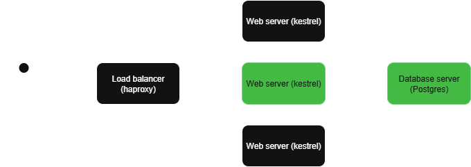

## Current Ansible Setup
Prior to this project and homelab, I'd had extremely minimal exposure to Ansible. I'd heard key terms such as playbook, and I was aware that Semaphore existed and provided a pretty front-end for it, but I'd never gotten my hands dirty. And that's precisely what this homelab is all about - giving me opportunities that I need to progress. 

As I've mentioned previously, the ultimate goal here is to run one script that spins up my entire infra. I've covered Terraform in a previous post, and now it's time to talk Ansible. 

## Infrastructure Architecture
Currently, I have a basic CRUD app with the typical old-school architecture; load balancer, web server(s), and database server. At the time of this post, Ansible playbooks have been created for the web server and database server, and I must say that they're working pretty well. And they should be, because the amount of iterations they've been through is frankly insane. Hurdle after hurdle! 

The green highlighted areas are what we'll cover today.

## Web server
[You can find the web server playbook here.](https://github.com/RichNye/homelab/blob/master/ansible/playbooks/setup_web.yaml)

This playbook is all about grabbing the self-contained published .NET Core app and ensuring it's configured as a service and running. I really do recommend creating your own basic app for this process; while it doubles the work required for the entire project, it really does give you far more insight than you'd get if you were just handed an app to get working. 

The steps are, roughly, as follows:
- Make sure we've got a directory created to house this app. I went for /opt/ here as it seemed most logical to keep it completely separate from user directories. 
- Create a .env file to house the environment variables required for the app. I'm not sure if this was the best way of doing things, but it does definitely work and offers flexibility. I need to investigate how to securely create the connection string - maybe using Ansible Vault?
- Copy the built and published self-contained app. I went self-contained because it makes this Ansible playbook far, far simpler. There's no faffing around trying to install and configure the dotnet runtime, but there's pros and cons to it. I won't cover that here.
- Make the main binary executable.
- Create the unit file for the service. This was an interesting exercise and was interesting to see behind the scenes. I went quite boilerplate for this as I didn't have the time to deep-dive. 
- Reload systemd - yet at this stage I was reloading systemd every. Single. Time. I'm working on implementing handlers!
- Restart the MealPlannerApi service, again every single time. Embarrassing to look back on this.
- Check that the service is enabled and started. At least this one doesn't run every time...

Overall, at this stage it was working well but there are improvements coming. Primarily around securely creating environment variables (connection string, primarily) and implementing handlers so that actions aren't firing when no changes have occurred.

## Database server
This was an absolute battle. I'm not overly familiar with Postgres - I've dabbled a bit, but we're talking basic CRUD stuff, not DBA work. The Ansible docs were helpful here but there seemed to be many ways to do the same thing, which didn't help. I settled on the following:
- Install Postgresql, nice and simple.
- Install acl - should've been combined into one apt task, really.
- Install psycopg2 - again, should've been one combined task...
- Ensure postgresql is running
- Create the database user for the app. Password in plain text here. Awful.
- Create the app database with the owner as the user.

Simple, but I've done many improvements in a different branch since. I need to finalise those changes and get them merged. I'll cover that in a future post once it's done. 

## Hindsight Reflection
My number one failure here is not starting this blog earlier. It's been two months since I even looked at this Ansible setup and it shows. I remember needing psycopg2 and acl for a specific reason but can't remember why. I wasn't documenting anything at the time and that was my undoing. Treat your homelabs like they're production systems - document everything! 

I've also started a new branch with many improvements, but again I can't remember where I was at. I'd like to implement this like a proper project - utilising GitHub project tools along the way will help with that. I also desperately need to improve my branch and commit hygiene. I've created a branch to facilitate multiple environments, which is far too overarching and I've lost all semblance of order. I think I'll do a future post on the dev part of devops, because it's something I've definitely struggled with the most. The concepts themselves aren't hard, but building the habit definitely is. It feels like an art form!

As always, thanks for reading, and do reach out to me via email with any questions or thoughts.

